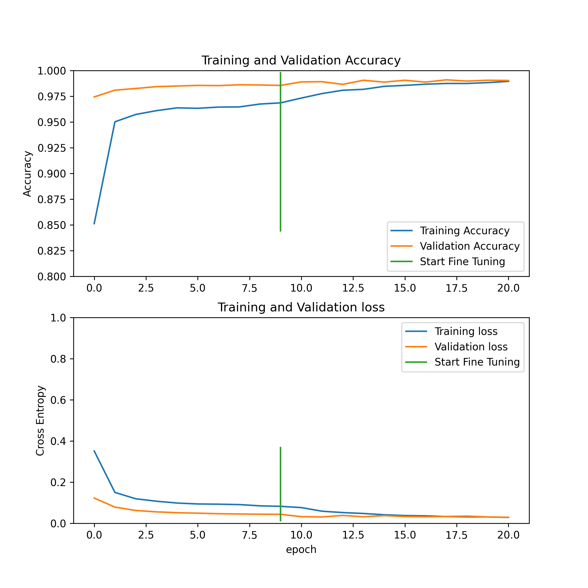

# Cat_or_Dog_MobilenetV2
This repository shows a simple transfer learning for a cat or dog classification with MobileNetV2. The dataset is obtained from the [Kaggle competition](https://www.kaggle.com/competitions/dogs-vs-cats/overview).

Dataset should be downloaded and placed in the working directory with the specified folders of cat or dog. The training process is divided into 2 part, where the first one is just training the added head and the second part trains layers after the 90th layer for fine-tuning.

Same results can be acquired in a python 3.8 environment with the provided requirements file with 
```
pip install -r requirements.txt
```

Later training can be started just with
```
python train.py
```
from the command line and results should be same as it is shown below for loss and accuracy. Additionally, using tensorboard, other metrics can be obcserved with
```
tensorboard --logdir logs
```

